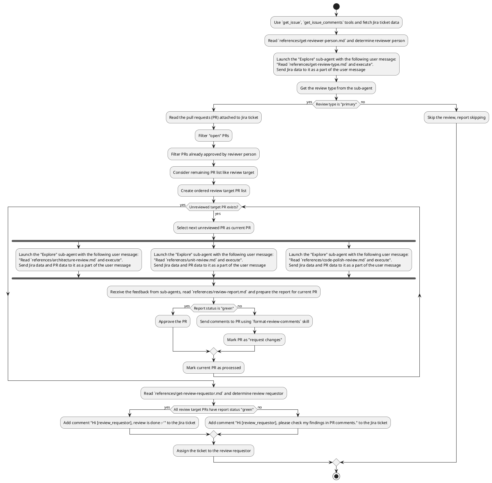

Read the deep code review workflow description. Take rules in account and follow workflow algorithm exactly as desribed. The algorithm is described in PlantUML for better clarity.

# Deep Code Review Workflow

## General rules (applies to entire workflow, including subagents)
- The workflow is read-only for local resources (files, directories), but you are allowed to call tools and modify external resources (f. e. to post a review comments)

## Workflow
