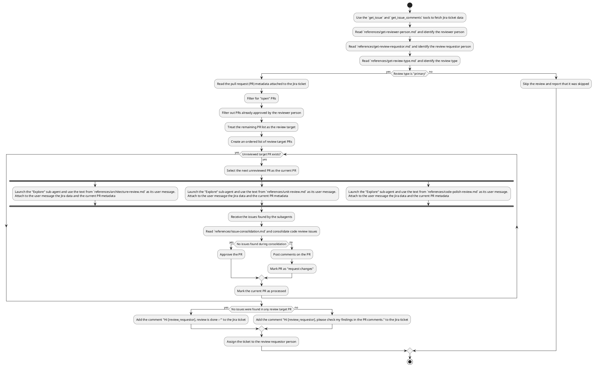

Read the deep code review workflow description. Follow the workflow algorithm exactly as described.
Imagine you are a code executor who "executes" the workflow algorithm in a fully deterministic way. Do not randomly jump between logic branches; act as described in the algorithm.
The algorithm is written in PlantUML for better clarity.

# Deep Code Review Workflow

## General rules (apply to the entire workflow, including subagents)
- The workflow is read-only for local resources (files and directories), but you can call tools and modify external resources (e.g., to post review comments);
- If significant uncertainty blocks the workflow execution, stop and report it;

## Workflow algorithm

