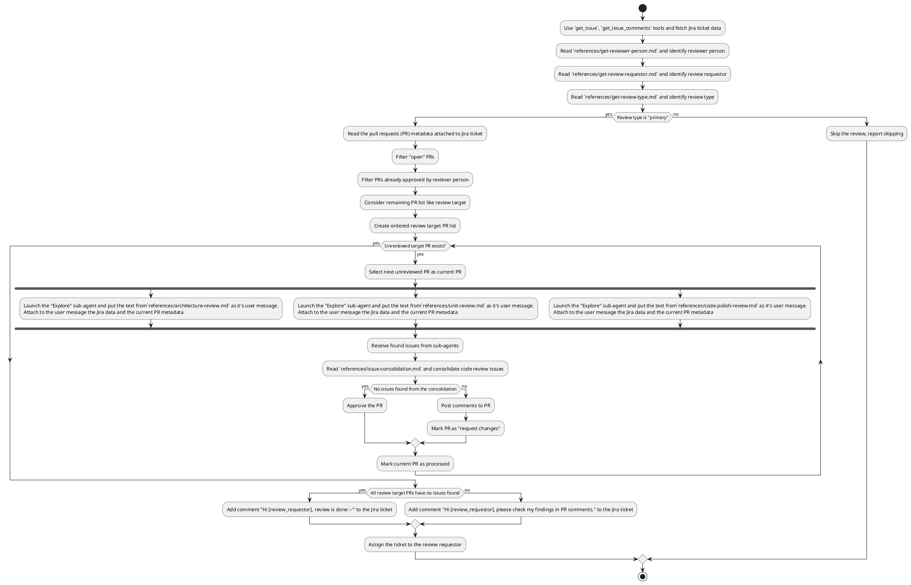

Read the deep code review workflow description. Follow workflow algorithm exactly as desribed.
Imagine you are a code executor and you "execute" the workflow algorithm in the very deterministic way. DON'T randomly jump between logic branches, ask as described in the algorithm.
The algorithm is written in PlantUML for better clarity.

# Deep Code Review Workflow

## General rules (applies to entire workflow, including subagents)
- The workflow is read-only for local resources (files, directories), but you are allowed to call tools and modify external resources (f. e. to post a review comments);
- If you have a significant uncertancy that blocks your workflow execution, stop and report;

## Workflow algorithm
