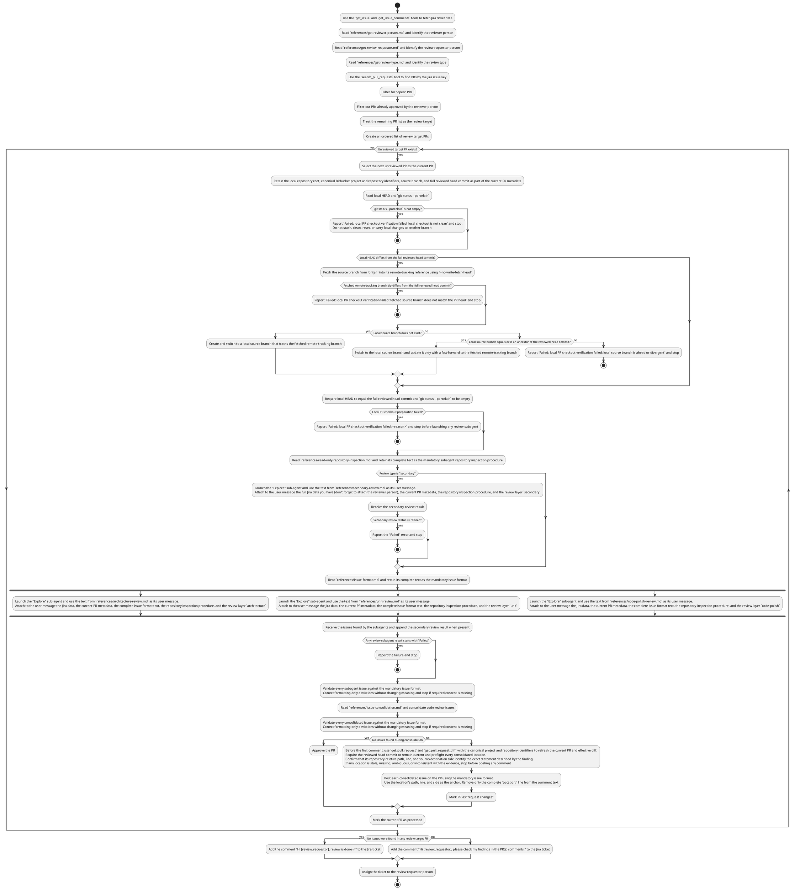

Read the deep code review workflow description. Follow the workflow algorithm exactly as described.
Imagine you are a code executor who "executes" the workflow algorithm in a fully deterministic way. Do not randomly jump between logic branches; act as described in the algorithm.
The algorithm is written in PlantUML for better clarity.

# Deep Code Review Workflow

## General rules (apply to the entire workflow, including subagents)
- The orchestrator may modify local Git state only to prepare the verified PR checkout described below. Review subagents are strictly read-only for local resources and must not use Git worktrees. You can call tools and modify external resources (e.g., to post review comments);
- If significant uncertainty blocks the workflow execution, stop and report it;
- Use lazy references loading. Read/load files in `references/` directory ONLY when you reach a workflow step where the file name is mentioned.

## Workflow algorithm

